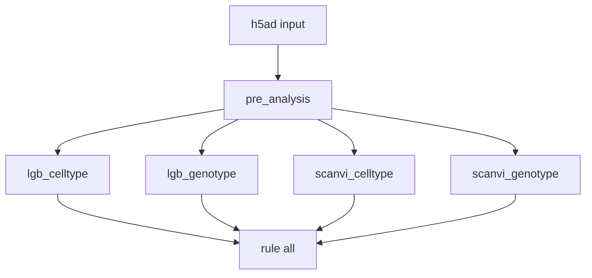

# PertTF Benchmark Pipeline

Benchmark repository for comparing **LightGBM** (PCA-based) and **scANVI** (deep learning) classifiers on single-cell perturbation data. The pipeline evaluates two prediction tasks using 5-fold stratified cross-validation:

- **Cell type classification** (`celltype_2` label)
- **Genotype classification** (`genotype` label)

## Repository Structure

| Path | Description |
|------|-------------|
| `object_integrated_assay3_annotated_final.modified.cleaned.updated.celltype2_only.h5ad` | Input AnnData object (~170k cells) |
| `pre_analysis.py` | Exploratory metadata inspection (distributions, missing values) |
| `LGB_celltype.py` | LightGBM benchmark for cell type prediction |
| `LGB_genotype.py` | LightGBM benchmark for genotype prediction |
| `scVI/scVI_analysis_celltype.py` | scANVI deep-learning benchmark for cell type |
| `scVI/scVI_analysis_genotype.py` | scANVI deep-learning benchmark for genotype |
| `Snakefile` | Snakemake workflow orchestrator |
| `run_pipeline.slurm` | SLURM batch submission script for HPC execution |

## Script Details

### `pre_analysis.py`
Loads the h5ad file and prints metadata column names, genotype/cell type distributions, and missing-value counts. Produces a completion marker (`pre_analysis.done`) for downstream rules.

### `LGB_celltype.py` / `LGB_genotype.py`
1. Normalize counts, log-transform, select 5000 HVGs, compute 100 PCs
2. Run 5-fold stratified CV with Optuna hyperparameter tuning (50 trials/fold)
3. Save per-fold metrics, ROC/PR curves, and pooled out-of-fold (OOF) summaries

Outputs:
- `celltype_split/` or `genotype_split/`
- Per-fold: `evaluation_metrics.csv`, `classification_report.txt`, `best_params.csv`, curves
- Overall: `overall_evaluation_metrics.csv`, `overall_classification_report.txt`

### `scVI/scVI_analysis_celltype.py` / `scVI/scVI_analysis_genotype.py`
1. Subset to 5000 HVGs with raw count preservation for scVI
2. Per fold: train scVI (150 epochs) then scANVI (30 epochs) on GPU
3. Evaluate on held-out fold; aggregate OOF metrics

Outputs:
- `scVI/scanvi_celltype_split/` or `scVI/scanvi_genotype_split/`

## Snakemake DAG



The four benchmark rules (`lgb_celltype`, `lgb_genotype`, `scanvi_celltype`, `scanvi_genotype`) run in parallel after `pre_analysis` completes. GPU resources (`gpu=1`) are requested for scANVI rules.

## Environment Setup

```bash
conda activate pertTF_bench
```

Required packages (pre-installed in `pertTF_bench`): `snakemake`, `scanpy`, `lightgbm`, `optuna`, `scvi-tools`, `scikit-learn`, `matplotlib`, `pandas`, `numpy`.

## Running the Pipeline

### HPC: SLURM batch submission (recommended)

```bash
cd /autofs/projects-t3/lilab/vmenon/benchmarking_revision_PertTF_LGB
sbatch run_pipeline.slurm
```

`run_pipeline.slurm` requests:
- Account/partition: `ihc`
- Node: `ihc-h200-1`
- Memory: 400G
- Time: 600 minutes
- GPUs: 1

### HPC: Interactive GPU session

```bash
srun --account=ihc --partition=ihc --nodelist=ihc-h200-1 --mem=400G --time=600 --gres=gpu:1 --pty bash
conda activate pertTF_bench
cd /autofs/projects-t3/lilab/vmenon/benchmarking_revision_PertTF_LGB
snakemake --cores 8
```

### Dry run (workflow validation only)

```bash
conda activate pertTF_bench
snakemake -n
```

## CI/CD

GitHub Actions workflow (`.github/workflows/snakemake_ci.yml`) runs on push to `main` or `benchmark`:
1. Lint Python scripts with `flake8`
2. Syntax-check all `.py` files
3. Execute `snakemake -n` dry run

## Logs

- `execution_log.md` — pipeline setup and deployment log
- `error_log.md` — error trace log (if any)
